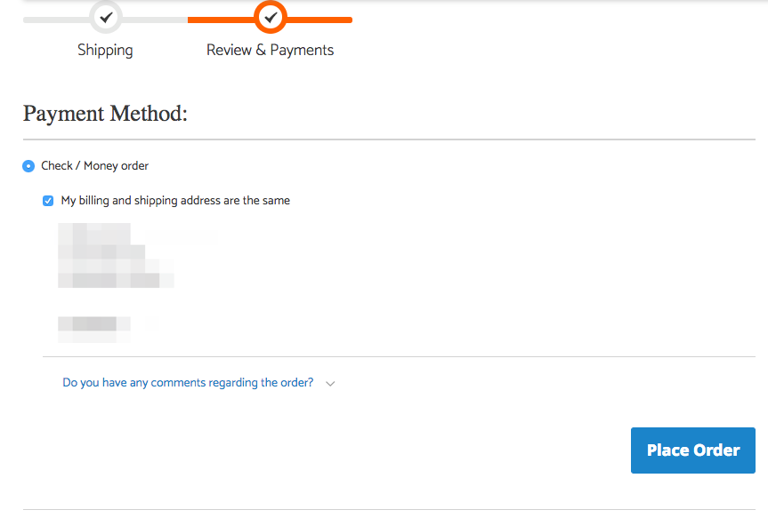
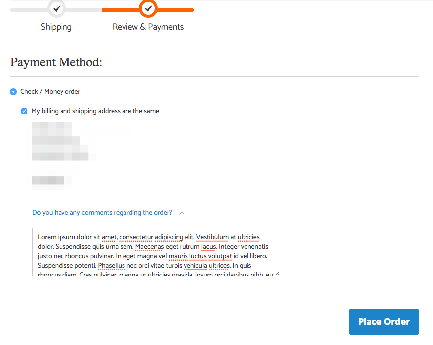
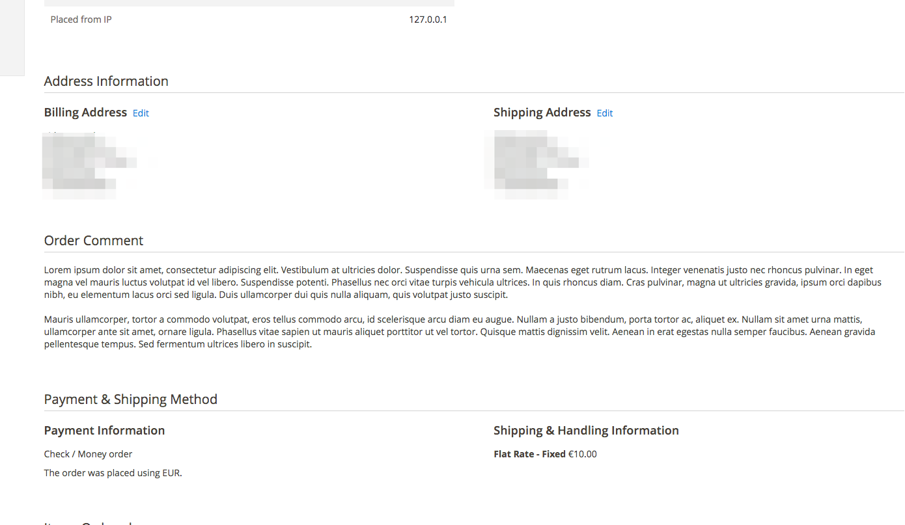

# Bold Commerce: Magento 2 Order Comments

## Description
This extension allows customers to place a comment during the checkout.
The comment field is displayed in the billing step right above the place order button.

Store owners can then see these comments in the backend on the order grid and on the order view page.

### Checkout view





### Admin panel


## Installation
```
composer require "boldcommerce/magento2-ordercomments":"~1.1.1"
php bin/magento module:enable Bold_OrderComment
php bin/magento setup:upgrade
```

## Changelog
1.1.1
=============
* Swedish translations and fixes in German translations [#5](https://github.com/boldcommerce/magento2-ordercomments/pull/5)

1.1.0
=============
* German translations [#2](https://github.com/boldcommerce/magento2-ordercomments/pull/2)
* Optional configuration for maximum comment length [#3](https://github.com/boldcommerce/magento2-ordercomments/pull/3)
* Show order comments in customer account [#4](https://github.com/boldcommerce/magento2-ordercomments/pull/4)

1.0.0
=============
initial version

## Technical
To take in account third party payment extensions using custom implementations of Magento_Checkout/js/action/place-order.js to submit the order, this extension sends
the order comment in a separate request during the validation, before the order is placed. It should therefore work out of
the box.


## Uninstall
If you installed this module through composer, then you can run `php bin/magento module:uninstall Bold_OrderComment` to automatically
remove the code and drop the columns added by this extension.

*note:* the uninstall command seems bugged and might get stuck at `Removing code from Magento codebase:` (It worked fine for me on a 2.1.0 install but not on a 2.1.4 install). When this happens you should
exit with `ctrl+c` and run 
```
composer update
php bin/magento maintenance:disable
```
See [github issue 3544](https://github.com/magento/magento2/issues/3544)

Alternatively you can manually remove the extension and remove the column `bold_order_comment` from the tables
* quote
* sales_order
* sales_order_grid

## License
MIT